# 🔬 TITAN-X SoC — Complete Manual Verification Guide

**Bottom-Up Simulation Commands for Every Module, Integration Tests, and Way Forward**

> [!IMPORTANT]
> All commands assume you are working from the repository root:
> ```bash
> cd /home/anupam-sarashwat/SMVDU-TitanX-RTL-All-Modules
> ```
> **Tool versions:** Icarus Verilog 13.0, GTKWave (any version)

---

## 📐 Module Hierarchy Overview

```mermaid
graph TD
    classDef leaf fill:#2d5016,stroke:#4ade80,color:#fff
    classDef mid fill:#1e3a5f,stroke:#60a5fa,color:#fff
    classDef top fill:#5b1e1e,stroke:#f87171,color:#fff
    classDef integ fill:#4a1d6e,stroke:#c084fc,color:#fff

    T[titan_x_top]:::top --> CORE[rv_core_top ×5]:::mid
    T --> AXI[axi4_crossbar]:::mid
    T --> L2T[l2_cache_top]:::mid
    T --> DDR[ddr_ctrl_top]:::mid
    T --> A2H[axi4_to_ahb]:::leaf
    T --> H2A[ahb_to_apb]:::leaf
    T --> PERIPH[Peripherals ×15]:::leaf
    T --> SEC[Security ×4]:::leaf
    T --> VID[Video ×4]:::leaf
    T --> STOR[Storage ×3]:::leaf

    CORE --> FE[rv_fetch]:::leaf
    CORE --> DEC[rv_decode]:::leaf
    CORE --> EXE[rv_execute]:::leaf
    CORE --> FPU[rv_fpu]:::leaf
    CORE --> MEM[rv_mem]:::leaf
    CORE --> WB[rv_writeback]:::leaf
    CORE --> IC[rv_icache]:::leaf
    CORE --> DC[rv_dcache]:::leaf
    CORE --> MMU[rv_mmu]:::leaf
    CORE --> TLB[rv_tlb]:::leaf
    CORE --> PTW[rv_ptw]:::leaf
    CORE --> PMP[rv_pmp]:::leaf
    CORE --> BPU[rv_bpu]:::leaf
    CORE --> CSR[rv_csr]:::leaf
    CORE --> REG[rv_regfile]:::leaf
    CORE --> DBG[rv_debug]:::leaf

    L2T --> L2C[l2_cache_ctrl]:::leaf
    L2T --> L2TAG[l2_tag_array]:::leaf
    L2T --> L2DAT[l2_data_array]:::leaf
    L2T --> L2SNP[l2_snoop_filter]:::leaf

    DDR --> PHY[ddr_phy_if]:::leaf
    DDR --> SCHED[ddr_scheduler]:::leaf
```



**Legend:**
- 🟢 **Leaf (Green):** Self-contained modules — simulate individually
- 🔵 **Mid-level (Blue):** Wrappers that instantiate leaves — simulate with dependencies
- 🔴 **Top (Red):** Full SoC — needs everything
- 🟣 **Integration:** Cross-subsystem functional tests

---

## 🏗️ Level 0: LEAF Modules (Self-Contained — Simulate Individually)

These modules have **no dependencies on other custom modules**. Each can be compiled and simulated with just its own design file and testbench.

### Common Utilities

#### 1. CDC Synchronizer
```bash
cd common/cdc_sync
iverilog -g2012 -o sim.vvp tb_cdc_sync.v cdc_sync.v
vvp sim.vvp
gtkwave tb_cdc_sync.vcd &
```
**Key signals to inspect:** `din`, `dout`, `clk_a`, `clk_b` — verify 2-FF synchronization latency

#### 2. Synchronous FIFO
```bash
cd common/fifo_sync
iverilog -g2012 -o sim.vvp tb_fifo_sync.v fifo_sync.v
vvp sim.vvp
gtkwave tb_fifo_sync.vcd &
```
**Key signals:** `wr_en`, `rd_en`, `full`, `empty`, `data_in`, `data_out`

#### 3. Asynchronous FIFO
```bash
cd common/fifo_async
iverilog -g2012 -o sim.vvp tb_fifo_async.v fifo_async.v
vvp sim.vvp
gtkwave tb_fifo_async.vcd &
```
**Key signals:** `wr_clk`, `rd_clk`, `full`, `empty` — verify gray-code pointer crossing

#### 4. Reset Synchronizer
```bash
cd common/reset_sync
iverilog -g2012 -o sim.vvp tb_reset_sync.v reset_sync.v
vvp sim.vvp
gtkwave tb_reset_sync.vcd &
```
**Key signals:** `rst_in`, `rst_out`, `clk` — verify de-assertion is synchronous

#### 5. BUFX4 Cell Stub
```bash
cd common/BUFX4
iverilog -g2012 -o sim.vvp tb_BUFX4.v buf_macros.v
vvp sim.vvp
```
**Key signals:** `A`, `Y` — simple buffer pass-through

---

### CPU Pipeline Components

#### 6. Register File (rv_regfile)
```bash
cd backend/rv_regfile
iverilog -g2012 -o sim.vvp tb_rv_regfile.v rv_regfile.v
vvp sim.vvp
gtkwave tb_rv_regfile.vcd &
```
**Key signals:** `rs1_addr`, `rs1_data`, `rs2_addr`, `rs2_data`, `rd_addr`, `rd_data`, `rd_wen` — verify x0 is always zero, write-then-read returns correct value

#### 7. CSR Unit (rv_csr)
```bash
cd backend/rv_csr
iverilog -g2012 -o sim.vvp -I ../../includes tb_rv_csr.v rv_csr.v ../../includes/stdcell_stubs.v
vvp sim.vvp
gtkwave tb_rv_csr.vcd &
```
**Key signals:** `csr_addr`, `csr_wdata`, `csr_rdata`, `priv_mode`, `mstatus`, `mepc`, `mcause` — verify privilege mode transitions and trap vector

#### 8. Execute Unit (rv_execute)
```bash
cd backend/rv_execute
iverilog -g2012 -o sim.vvp -I ../../includes tb_rv_execute.v rv_execute.v ../../includes/stdcell_stubs.v
vvp sim.vvp
gtkwave tb_rv_execute.vcd &
```
**Key signals:** `alu_result`, `alu_op`, `operand_a`, `operand_b`, `branch_taken`, `branch_target` — verify ADD/SUB/AND/OR/XOR/SLT/shifts and branch conditions

#### 9. FPU (rv_fpu)
```bash
cd backend/rv_fpu
iverilog -g2012 -o sim.vvp tb_rv_fpu.v rv_fpu.v
vvp sim.vvp
gtkwave tb_rv_fpu.vcd &
```
**Key signals:** `fp_operand_a`, `fp_operand_b`, `fp_result`, `fp_op`, `fflags` — verify FADD, FMUL, FDIV, FSQRT, FCVT, exception flags (NV, DZ, OF, UF, NX)

#### 10. Memory Stage (rv_mem)
```bash
cd backend/rv_mem
iverilog -g2012 -o sim.vvp tb_rv_mem.v rv_mem.v
vvp sim.vvp
gtkwave tb_rv_mem.vcd &
```
**Key signals:** `mem_addr`, `mem_wdata`, `mem_rdata`, `mem_wen`, `mem_size`, `stall_req`

#### 11. Writeback Stage (rv_writeback)
```bash
cd backend/rv_writeback
iverilog -g2012 -o sim.vvp tb_rv_writeback.v rv_writeback.v
vvp sim.vvp
gtkwave tb_rv_writeback.vcd &
```
**Key signals:** `rd_idx`, `rd_data`, `rd_wen`, `wb_sel` — verify ALU result vs memory load selection

#### 12. Fetch Unit (rv_fetch)
```bash
cd frontend/rv_fetch
iverilog -g2012 -o sim.vvp tb_rv_fetch.v rv_fetch.v
vvp sim.vvp
gtkwave tb_rv_fetch.vcd &
```
**Key signals:** `pc`, `pc_next`, `inst`, `inst_valid`, `flush`, `stall` — verify sequential PC increment, flush redirect, stall hold

#### 13. Decode Unit (rv_decode)
```bash
cd frontend/rv_decode
iverilog -g2012 -o sim.vvp tb_rv_decode.v rv_decode.v
vvp sim.vvp
gtkwave tb_rv_decode.vcd &
```
**Key signals:** `inst`, `rs1`, `rs2`, `rd`, `imm`, `alu_op`, `opcode` — verify R/I/S/B/U/J type decoding

#### 14. Branch Prediction Unit (rv_bpu)
```bash
cd frontend/rv_bpu
iverilog -g2012 -o sim.vvp tb_rv_bpu.v rv_bpu.v
vvp sim.vvp
gtkwave tb_rv_bpu.vcd &
```
**Key signals:** `pc`, `predict_taken`, `predict_target`, `update_valid`, `update_taken`, `btb_hit` — verify BTB hit/miss and BHT saturation counter

#### 15. I-Cache (rv_icache)
```bash
cd frontend/rv_icache
iverilog -g2012 -o sim.vvp tb_rv_icache.v rv_icache.v
vvp sim.vvp
gtkwave tb_rv_icache.vcd &
```
**Key signals:** `addr`, `hit`, `miss`, `data_out`, `refill_valid`, `tag_match` — verify cache hit/miss behavior

#### 16. D-Cache (rv_dcache)
```bash
cd backend/rv_dcache
iverilog -g2012 -o sim.vvp tb_rv_dcache.v rv_dcache.v
vvp sim.vvp
gtkwave tb_rv_dcache.vcd &
```
**Key signals:** `addr`, `hit`, `dirty`, `writeback`, `data_out`, `data_in` — verify write-back policy and dirty eviction

#### 17. TLB (rv_tlb)
```bash
cd backend/rv_tlb
iverilog -g2012 -o sim.vvp tb_rv_tlb.v rv_tlb.v
vvp sim.vvp
gtkwave tb_rv_tlb.vcd &
```
**Key signals:** `vpn`, `ppn`, `hit`, `miss`, `flush`, `asid` — verify virtual-to-physical translation lookup

#### 18. Page Table Walker (rv_ptw)
```bash
cd backend/rv_ptw
iverilog -g2012 -o sim.vvp tb_rv_ptw.v rv_ptw.v
vvp sim.vvp
gtkwave tb_rv_ptw.vcd &
```
**Key signals:** `ptw_req`, `ptw_vpn`, `ptw_pte`, `ptw_done`, `ptw_level`, `page_fault` — verify 3-level Sv39 walk (VPN[2] → VPN[1] → VPN[0])

#### 19. MMU (rv_mmu)
```bash
cd backend/rv_mmu
iverilog -g2012 -o sim.vvp tb_rv_mmu.v rv_mmu.v
vvp sim.vvp
gtkwave tb_rv_mmu.vcd &
```
**Key signals:** `satp`, `priv_mode`, `va_in`, `pa_out`, `page_fault`, `access_fault` — verify Sv39 enable/disable, bare mode bypass

#### 20. PMP (rv_pmp)
```bash
cd backend/rv_pmp
iverilog -g2012 -o sim.vvp tb_rv_pmp.v rv_pmp.v
vvp sim.vvp
gtkwave tb_rv_pmp.vcd &
```
**Key signals:** `pmpcfg`, `pmpaddr`, `check_addr`, `check_type`, `allow`, `deny` — verify TOR/NAPOT/NA4 region matching

#### 21. Debug Module (rv_debug)
```bash
cd backend/rv_debug
iverilog -g2012 -o sim.vvp tb_rv_debug.v rv_debug.v
vvp sim.vvp
gtkwave tb_rv_debug.vcd &
```
**Key signals:** `halt_req`, `resume_req`, `halted`, `running`, `dpc` — verify halt/resume handshake

#### 22. CLINT (Core Local Interruptor)
```bash
cd backend/clint
iverilog -g2012 -o sim.vvp tb_clint.v clint.v
vvp sim.vvp
gtkwave tb_clint.vcd &
```
**Key signals:** `mtime`, `mtimecmp`, `timer_irq`, `sw_irq` — verify `mtime >= mtimecmp` triggers timer_irq

#### 23. PLIC (Platform Level Interrupt Controller)
```bash
cd backend/plic
iverilog -g2012 -o sim.vvp tb_plic.v plic.v
vvp sim.vvp
gtkwave tb_plic.vcd &
```
**Key signals:** `irq_sources`, `priority`, `threshold`, `claim`, `complete`, `ext_irq` — verify priority-based arbitration

#### 24. Monitor Core (rv_monitor_core)
```bash
cd backend/rv_monitor_core
iverilog -g2012 -o sim.vvp tb_rv_monitor_core.v rv_monitor_core.v
vvp sim.vvp
gtkwave tb_rv_monitor_core.vcd &
```
**Key signals:** `pc`, `inst`, `mon_active` — verify basic RV64IMAC instruction execution

---

### Memory Subsystem Components

#### 25. SRAM 32×64 Macro
```bash
cd memory/sram_32x64_180nm
iverilog -g2012 -o sim.vvp tb_sram_32x64_180nm.v sram_32x64_180nm.v
vvp sim.vvp
gtkwave tb_sram_32x64_180nm.vcd &
```
**Key signals:** `addr`, `din`, `dout`, `wen`, `cen` — verify write-then-read data integrity

#### 26. SRAM 512K×8 Macro
```bash
cd memory/sram_512kx8_180nm
iverilog -g2012 -o sim.vvp tb_sram_512kx8_180nm.v sram_512kx8_180nm.v
vvp sim.vvp
gtkwave tb_sram_512kx8_180nm.vcd &
```
**Key signals:** Same as above but for the larger macro

#### 27. L2 Cache Controller
```bash
cd memory/l2_cache_ctrl
iverilog -g2012 -o sim.vvp tb_l2_cache_ctrl.v l2_cache_ctrl.v
vvp sim.vvp
gtkwave tb_l2_cache_ctrl.vcd &
```
**Key signals:** `state`, `hit`, `miss`, `evict`, `writeback` — verify FSM transitions

#### 28. L2 Tag Array
```bash
cd memory/l2_tag_array
iverilog -g2012 -o sim.vvp tb_l2_tag_array.v l2_tag_array.v
vvp sim.vvp
gtkwave tb_l2_tag_array.vcd &
```
**Key signals:** `tag_in`, `tag_out`, `valid`, `dirty`, `way_sel` — verify tag match logic

#### 29. L2 Data Array
```bash
cd memory/l2_data_array
iverilog -g2012 -o sim.vvp tb_l2_data_array.v l2_data_array.v
vvp sim.vvp
gtkwave tb_l2_data_array.vcd &
```
**Key signals:** `data_in`, `data_out`, `addr`, `wen` — verify read/write data paths

#### 30. L2 Snoop Filter
```bash
cd memory/l2_snoop_filter
iverilog -g2012 -o sim.vvp tb_l2_snoop_filter.v l2_snoop_filter.v
vvp sim.vvp
gtkwave tb_l2_snoop_filter.vcd &
```
**Key signals:** `snoop_addr`, `snoop_hit`, `invalidate`, `state` (MESI) — verify coherence tracking

#### 31. DDR PHY Interface
```bash
cd memory/ddr_phy_if
iverilog -g2012 -o sim.vvp tb_ddr_phy_if.v ddr_phy_if.v
vvp sim.vvp
gtkwave tb_ddr_phy_if.vcd &
```
**Key signals:** `ddr_ck_p/n`, `ddr_cke`, `ddr_cs_n`, `ddr_dq`, `ddr_dqs_p/n` — verify DDR4 timing

#### 32. DDR Scheduler
```bash
cd memory/ddr_scheduler
iverilog -g2012 -o sim.vvp tb_ddr_scheduler.v ddr_scheduler.v
vvp sim.vvp
gtkwave tb_ddr_scheduler.vcd &
```
**Key signals:** `cmd_valid`, `cmd_type` (ACT/RD/WR/PRE), `bank`, `row`, `col`, `ready` — verify open-page/close-page scheduling

---

### Interconnect Components

#### 33. AXI4-to-AHB Bridge
```bash
cd interconnect/axi4_to_ahb
iverilog -g2012 -o sim.vvp tb_axi4_to_ahb.v axi4_to_ahb.v
vvp sim.vvp
gtkwave tb_axi4_to_ahb.vcd &
```
**Key signals:** `axi_arvalid/arready`, `ahb_htrans`, `ahb_hwrite`, `ahb_haddr` — verify protocol translation

#### 34. AHB-to-APB Bridge
```bash
cd interconnect/ahb_to_apb
iverilog -g2012 -o sim.vvp tb_ahb_to_apb.v ahb_to_apb.v
vvp sim.vvp
gtkwave tb_ahb_to_apb.vcd &
```
**Key signals:** `ahb_htrans`, `apb_psel`, `apb_penable`, `apb_pwrite` — verify NONSEQ → psel/penable sequence

#### 35. APB Bridge
```bash
cd interconnect/apb_bridge
iverilog -g2012 -o sim.vvp tb_apb_bridge.v apb_bridge.v
vvp sim.vvp
gtkwave tb_apb_bridge.vcd &
```
**Key signals:** `paddr`, `psel_0..psel_n`, `prdata`, `pwdata` — verify address decode to correct peripheral

#### 36. AXI4 Crossbar
```bash
cd interconnect/axi4_crossbar
iverilog -g2012 -o sim.vvp tb_axi4_crossbar.v axi4_crossbar.v
vvp sim.vvp
gtkwave tb_axi4_crossbar.vcd &
```
**Key signals:** `m0_awvalid/awready`, `s0_awvalid/awready`, `arb_grant` — verify routing M[i] → S[j]

#### 37. AXI4 Burst-to-Lite Converter
```bash
cd interconnect
iverilog -g2012 -o sim.vvp tb_axi4_burst_to_lite.v axi4_burst_to_lite.v
vvp sim.vvp
gtkwave tb_axi4_burst_to_lite.vcd &
```
**Key signals:** `arlen`, `arsize`, `lite_arvalid` — verify burst decomposition

#### 38. QoS Controller
```bash
cd interconnect/qos_controller
iverilog -g2012 -o sim.vvp tb_qos_controller.v qos_controller.v
vvp sim.vvp
gtkwave tb_qos_controller.vcd &
```
**Key signals:** `bandwidth`, `threshold`, `boost`, `throttle` — verify QoS policy enforcement

#### 39. MPU (Memory Protection Unit)
```bash
cd interconnect/interconnect_mpu
iverilog -g2012 -o sim.vvp tb_interconnect_mpu.v mpu.v
vvp sim.vvp
gtkwave tb_interconnect_mpu.vcd &
```
**Key signals:** `region_base`, `region_limit`, `access_addr`, `access_type`, `grant/deny`

#### 40. MMU Arbiter
```bash
cd interconnect/mmu_arbiter
iverilog -g2012 -o sim.vvp tb_mmu_arbiter.v mmu_arbiter.v
vvp sim.vvp
gtkwave tb_mmu_arbiter.vcd &
```
**Key signals:** `req_0`, `req_1`, `grant_0`, `grant_1` — verify round-robin fairness

---

### Peripheral Components

#### 41. UART 16550
```bash
cd peripherals/uart_16550
iverilog -g2012 -o sim.vvp tb_uart_16550.v uart_16550.v
vvp sim.vvp
gtkwave tb_uart_16550.vcd &
```
**Key signals:** `uart_tx`, `uart_rx`, `baud_tick`, `thr`, `rbr`, `lsr` — verify TX start/stop/data bits, loopback mode

#### 42. CAN Controller
```bash
cd peripherals/can_controller
iverilog -g2012 -o sim.vvp tb_can_controller.v can_controller.v
vvp sim.vvp
gtkwave tb_can_controller.vcd &
```
**Key signals:** `can_tx`, `can_rx`, `arb_field`, `data_field`, `crc` — verify CAN 2.0B frame format

#### 43. I2C Master
```bash
cd peripherals/i2c_master
iverilog -g2012 -o sim.vvp tb_i2c_master.v i2c_master.v
vvp sim.vvp
gtkwave tb_i2c_master.vcd &
```
**Key signals:** `scl`, `sda`, `start`, `stop`, `ack` — verify START condition, 8-bit + ACK, STOP condition

#### 44. SPI Master
```bash
cd peripherals/spi_master
iverilog -g2012 -o sim.vvp tb_spi_master.v spi_master.v
vvp sim.vvp
gtkwave tb_spi_master.vcd &
```
**Key signals:** `sclk`, `mosi`, `miso`, `cs_n`, `cpol`, `cpha` — verify all 4 SPI modes

#### 45. GPIO Controller
```bash
cd peripherals/gpio_ctrl
iverilog -g2012 -o sim.vvp tb_gpio_ctrl.v gpio_ctrl.v
vvp sim.vvp
gtkwave tb_gpio_ctrl.vcd &
```
**Key signals:** `gpio_dir`, `gpio_out`, `gpio_in`, `gpio_irq` — verify input/output/interrupt modes

#### 46. RTC (Real-Time Clock)
```bash
cd peripherals/rtc
iverilog -g2012 -o sim.vvp tb_rtc.v rtc.v
vvp sim.vvp
gtkwave tb_rtc.vcd &
```
**Key signals:** `rtc_clk`, `counter`, `alarm`, `timer_irq` — verify counter increment and alarm match

#### 47. Watchdog Timer
```bash
cd peripherals/watchdog_timer
iverilog -g2012 -o sim.vvp tb_watchdog_timer.v watchdog_timer.v
vvp sim.vvp
gtkwave tb_watchdog_timer.vcd &
```
**Key signals:** `load_val`, `counter`, `enable`, `wdt_reset` — verify timeout triggers reset

#### 48. TRNG (True Random Number Generator)
```bash
cd peripherals/trng
iverilog -g2012 -o sim.vvp tb_trng.v trng.v
vvp sim.vvp
gtkwave tb_trng.vcd &
```
**Key signals:** `entropy_valid`, `random_data`, `health_check` — verify randomness source

#### 49. AES Engine
```bash
cd peripherals/aes_engine
iverilog -g2012 -o sim.vvp tb_aes_engine.v aes_engine.v
vvp sim.vvp
gtkwave tb_aes_engine.vcd &
```
**Key signals:** `key`, `plaintext`, `ciphertext`, `start`, `done` — verify NIST test vectors

#### 50. SHA-256 Engine
```bash
cd peripherals/sha256_engine
iverilog -g2012 -o sim.vvp tb_sha256_engine.v sha256_engine.v
vvp sim.vvp
gtkwave tb_sha256_engine.vcd &
```
**Key signals:** `data_in`, `hash_out`, `start`, `done` — verify known-answer hash

#### 51. Gigabit Ethernet MAC
```bash
cd peripherals/gem_ethernet
iverilog -g2012 -o sim.vvp tb_gem_ethernet.v gem_ethernet.v
vvp sim.vvp
gtkwave tb_gem_ethernet.vcd &
```
**Key signals:** `gmii_txd`, `gmii_rxd`, `tx_en`, `rx_dv`, `crc_valid` — verify frame TX/RX

#### 52. SGMII PCS
```bash
cd peripherals/gem_sgmii_pcs
iverilog -g2012 -o sim.vvp tb_gem_sgmii_pcs.v gem_sgmii_pcs.v
vvp sim.vvp
gtkwave tb_gem_sgmii_pcs.vcd &
```
**Key signals:** `sgmii_txd`, `sgmii_rxd`, `an_complete` — verify auto-negotiation

#### 53. PCIe PIPE Interface
```bash
cd peripherals/pcie_pipe_if
iverilog -g2012 -o sim.vvp tb_pcie_pipe_if.v pcie_pipe_if.v
vvp sim.vvp
gtkwave tb_pcie_pipe_if.vcd &
```
**Key signals:** `pipe_txdata`, `pipe_rxdata`, `pipe_txelecidle`, `pipe_rxstatus`

#### 54. PCIe Top
```bash
cd peripherals/pcie_top
iverilog -g2012 -o sim.vvp tb_pcie_top.v pcie_top.v ../pcie_pipe_if/pcie_pipe_if.v
vvp sim.vvp
gtkwave tb_pcie_top.vcd &
```
**Key signals:** `tlp_type`, `tlp_data`, `completion_valid`, `dma_req`

---

### Security Modules

#### 55. DRBG (Deterministic Random Bit Generator)
```bash
cd security/drbg
iverilog -g2012 -o sim.vvp tb_drbg.v drbg.v
vvp sim.vvp
gtkwave tb_drbg.vcd &
```
**Key signals:** `seed`, `generate`, `random_bits`, `reseed_req`

#### 56. ECDSA Engine
```bash
cd security/ecdsa_engine
iverilog -g2012 -o sim.vvp tb_ecdsa_engine.v ecdsa_engine.v
vvp sim.vvp
gtkwave tb_ecdsa_engine.vcd &
```
**Key signals:** `private_key`, `public_key`, `signature_r`, `signature_s`, `verify_pass`

#### 57. eNVM Controller
```bash
cd security/envm_ctrl
iverilog -g2012 -o sim.vvp tb_envm_ctrl.v envm_ctrl.v
vvp sim.vvp
gtkwave tb_envm_ctrl.vcd &
```
**Key signals:** `addr`, `data_out`, `program`, `erase`, `busy`

#### 58. Secure Boot
```bash
cd security/secure_boot
iverilog -g2012 -o sim.vvp tb_secure_boot.v secure_boot.v
vvp sim.vvp
gtkwave tb_secure_boot.vcd &
```
**Key signals:** `boot_state`, `hash_match`, `boot_pass`, `boot_fail`

---

### Storage Controllers

#### 59. MMC Controller
```bash
cd storage/mmc_controller
iverilog -g2012 -o sim.vvp tb_mmc_controller.v mmc_controller.v
vvp sim.vvp
gtkwave tb_mmc_controller.vcd &
```
**Key signals:** `cmd`, `cmd_resp`, `data_out`, `data_in`, `card_detect`

#### 60. QSPI Controller
```bash
cd storage/qspi_controller
iverilog -g2012 -o sim.vvp tb_qspi_controller.v qspi_controller.v
vvp sim.vvp
gtkwave tb_qspi_controller.vcd &
```
**Key signals:** `sclk`, `cs_n`, `io[3:0]`, `quad_mode`

#### 61. USB OTG
```bash
cd storage/usb_otg
iverilog -g2012 -o sim.vvp tb_usb_otg.v usb_otg.v
vvp sim.vvp
gtkwave tb_usb_otg.vcd &
```
**Key signals:** `ulpi_data`, `ulpi_dir`, `ulpi_nxt`, `ulpi_stp`

---

### Video/Multimedia

#### 62. MIPI CSI-2 Receiver
```bash
cd video/mipi_csi2_rx
iverilog -g2012 -o sim.vvp tb_mipi_csi2_rx.v mipi_csi2_rx.v
vvp sim.vvp
gtkwave tb_mipi_csi2_rx.vcd &
```
**Key signals:** `byte_data`, `data_type`, `line_valid`, `frame_valid`

#### 63. ISP Pipeline
```bash
cd video/isp_pipeline
iverilog -g2012 -o sim.vvp tb_isp_pipeline.v isp_pipeline.v
vvp sim.vvp
gtkwave tb_isp_pipeline.vcd &
```
**Key signals:** `pixel_in`, `pixel_out`, `r/g/b`, `demosaic_en`, `awb_gain`

#### 64. HDMI Controller
```bash
cd video/hdmi_ctrl
iverilog -g2012 -o sim.vvp tb_hdmi_ctrl.v hdmi_ctrl.v
vvp sim.vvp
gtkwave tb_hdmi_ctrl.vcd &
```
**Key signals:** `tmds_clk_p/n`, `tmds_data_p/n`, `pixel_data`, `hsync`, `vsync`, `de`

#### 65. Video DMA (VDMA)
```bash
cd video/vdma
iverilog -g2012 -o sim.vvp tb_vdma.v vdma.v
vvp sim.vvp
gtkwave tb_vdma.vcd &
```
**Key signals:** `src_addr`, `dst_addr`, `xfer_count`, `dma_done`, `axi_arvalid`

---

## 🏗️ Level 1: WRAPPER MODULES (Need Dependencies)

These modules instantiate leaf modules. You must include all dependencies.

### 66. DDR Controller Top (ddr_ctrl_top)
```bash
cd memory/ddr_ctrl_top
iverilog -g2012 -o sim.vvp -I ../../includes \
  tb_ddr_ctrl_top.v ddr_ctrl_top.v \
  ../ddr_phy_if/ddr_phy_if.v \
  ../ddr_scheduler/ddr_scheduler.v \
  ../../includes/stdcell_stubs.v
vvp sim.vvp
gtkwave tb_ddr_ctrl_top.vcd &
```
**Key signals:** All DDR4 pins + `cmd_type`, `state`, `bank_active`, `refresh_pending`

### 67. L2 Cache Top (l2_cache_top)
```bash
cd memory/l2_cache_top
iverilog -g2012 -o sim.vvp -I ../../includes \
  tb_l2_cache_top.v l2_cache_top.v \
  ../l2_cache_ctrl/l2_cache_ctrl.v \
  ../l2_tag_array/l2_tag_array.v \
  ../l2_data_array/l2_data_array.v \
  ../l2_snoop_filter/l2_snoop_filter.v \
  ../../includes/stdcell_stubs.v
vvp sim.vvp
gtkwave tb_l2_cache_top.vcd &
```
**Key signals:** `axi_araddr`, `hit`, `miss`, `snoop_hit`, `invalidate`, `mesi_state`

### 68. CPU Core Top (rv_core_top)
```bash
cd backend/rv_core_top
iverilog -g2012 -o sim.vvp -I ../../includes \
  tb_rv_core_top.v rv_core_top.v \
  ../../frontend/rv_fetch/rv_fetch.v \
  ../../frontend/rv_decode/rv_decode.v \
  ../../frontend/rv_bpu/rv_bpu.v \
  ../../frontend/rv_icache/rv_icache.v \
  ../rv_execute/rv_execute.v \
  ../rv_fpu/rv_fpu.v \
  ../rv_mem/rv_mem.v \
  ../rv_writeback/rv_writeback.v \
  ../rv_dcache/rv_dcache.v \
  ../rv_mmu/rv_mmu.v \
  ../rv_tlb/rv_tlb.v \
  ../rv_ptw/rv_ptw.v \
  ../rv_pmp/rv_pmp.v \
  ../rv_csr/rv_csr.v \
  ../rv_regfile/rv_regfile.v \
  ../rv_debug/rv_debug.v \
  ../../includes/stdcell_stubs.v
vvp sim.vvp
gtkwave tb_rv_core_top.vcd &
```
**Key signals:** `pc`, `inst`, `priv_mode`, `alu_result`, `branch_taken`, `trap_valid`, `satp` — this is **the most critical simulation** — verify full instruction execution pipeline

> [!TIP]
> There are **additional specialized testbenches** for the CPU core:
> ```bash
> # CSR-focused test
> iverilog -g2012 -o sim_csr.vvp -I ../../includes tb_rv_core_csr.v rv_core_top.v [all deps above]
> vvp sim_csr.vvp
>
> # Interrupt test
> iverilog -g2012 -o sim_irq.vvp -I ../../includes tb_rv_core_irq.v rv_core_top.v [all deps above]
> vvp sim_irq.vvp
>
> # M-extension (mul/div) test
> iverilog -g2012 -o sim_mext.vvp -I ../../includes tb_rv_core_mext.v rv_core_top.v [all deps above]
> vvp sim_mext.vvp
>
> # Write operations test
> iverilog -g2012 -o sim_wops.vvp -I ../../includes tb_rv_core_wops.v rv_core_top.v [all deps above]
> vvp sim_wops.vvp
>
> # Compliance test
> iverilog -g2012 -o sim_comp.vvp -I ../../includes tb_rv_core_compliance.v rv_core_top.v [all deps above]
> vvp sim_comp.vvp
> ```

---

## 🏗️ Level 2: FULL SOC TOP

### 69. TITAN-X SoC Top (titan_x_top)
```bash
cd top/titan_x_top
iverilog -g2012 -o sim.vvp -I ../../includes \
  tb_titan_x_top.v titan_x_top.v \
  ../axi_rom/axi_rom.v \
  ../../backend/rv_core_top/rv_core_top.v \
  ../../backend/rv_monitor_core/rv_monitor_core.v \
  ../../backend/clint/clint.v \
  ../../backend/plic/plic.v \
  ../../frontend/rv_fetch/rv_fetch.v \
  ../../frontend/rv_decode/rv_decode.v \
  ../../frontend/rv_bpu/rv_bpu.v \
  ../../frontend/rv_icache/rv_icache.v \
  ../../backend/rv_execute/rv_execute.v \
  ../../backend/rv_fpu/rv_fpu.v \
  ../../backend/rv_mem/rv_mem.v \
  ../../backend/rv_writeback/rv_writeback.v \
  ../../backend/rv_dcache/rv_dcache.v \
  ../../backend/rv_mmu/rv_mmu.v \
  ../../backend/rv_tlb/rv_tlb.v \
  ../../backend/rv_ptw/rv_ptw.v \
  ../../backend/rv_pmp/rv_pmp.v \
  ../../backend/rv_csr/rv_csr.v \
  ../../backend/rv_regfile/rv_regfile.v \
  ../../backend/rv_debug/rv_debug.v \
  ../../interconnect/axi4_crossbar/axi4_crossbar.v \
  ../../interconnect/axi4_to_ahb/axi4_to_ahb.v \
  ../../interconnect/ahb_to_apb/ahb_to_apb.v \
  ../../interconnect/apb_bridge/apb_bridge.v \
  ../../interconnect/qos_controller/qos_controller.v \
  ../../interconnect/interconnect_mpu/mpu.v \
  ../../interconnect/mmu_arbiter/mmu_arbiter.v \
  ../../interconnect/axi4_burst_to_lite.v \
  ../../memory/l2_cache_top/l2_cache_top.v \
  ../../memory/l2_cache_ctrl/l2_cache_ctrl.v \
  ../../memory/l2_tag_array/l2_tag_array.v \
  ../../memory/l2_data_array/l2_data_array.v \
  ../../memory/l2_snoop_filter/l2_snoop_filter.v \
  ../../memory/ddr_ctrl_top/ddr_ctrl_top.v \
  ../../memory/ddr_phy_if/ddr_phy_if.v \
  ../../memory/ddr_scheduler/ddr_scheduler.v \
  ../../memory/sram_32x64_180nm/sram_32x64_180nm.v \
  ../../memory/sram_512kx8_180nm/sram_512kx8_180nm.v \
  ../../peripherals/uart_16550/uart_16550.v \
  ../../peripherals/can_controller/can_controller.v \
  ../../peripherals/i2c_master/i2c_master.v \
  ../../peripherals/spi_master/spi_master.v \
  ../../peripherals/gpio_ctrl/gpio_ctrl.v \
  ../../peripherals/rtc/rtc.v \
  ../../peripherals/watchdog_timer/watchdog_timer.v \
  ../../peripherals/trng/trng.v \
  ../../peripherals/aes_engine/aes_engine.v \
  ../../peripherals/sha256_engine/sha256_engine.v \
  ../../peripherals/gem_ethernet/gem_ethernet.v \
  ../../peripherals/gem_sgmii_pcs/gem_sgmii_pcs.v \
  ../../peripherals/pcie_top/pcie_top.v \
  ../../peripherals/pcie_pipe_if/pcie_pipe_if.v \
  ../../security/drbg/drbg.v \
  ../../security/ecdsa_engine/ecdsa_engine.v \
  ../../security/envm_ctrl/envm_ctrl.v \
  ../../security/secure_boot/secure_boot.v \
  ../../storage/mmc_controller/mmc_controller.v \
  ../../storage/qspi_controller/qspi_controller.v \
  ../../storage/usb_otg/usb_otg.v \
  ../../video/mipi_csi2_rx/mipi_csi2_rx.v \
  ../../video/isp_pipeline/isp_pipeline.v \
  ../../video/hdmi_ctrl/hdmi_ctrl.v \
  ../../video/vdma/vdma.v \
  ../../includes/stdcell_stubs.v
vvp sim.vvp
gtkwave tb_titan_x_top.vcd &
```

---

## 🔗 Level 3: INTEGRATION TESTS

These test cross-subsystem interactions using BFMs (Bus Functional Models).

### 70. DDR4 BFM Integration
```bash
cd integration
iverilog -g2012 -o sim_ddr.vvp -I ../includes \
  tb_bfm_ddr4.v \
  ../bfm/ddr4_sdram_bfm.v ../bfm/axi_memory_model.v \
  ../memory/ddr_ctrl_top/ddr_ctrl_top.v \
  ../memory/ddr_phy_if/ddr_phy_if.v \
  ../memory/ddr_scheduler/ddr_scheduler.v \
  ../includes/stdcell_stubs.v
vvp sim_ddr.vvp
gtkwave tb_bfm_ddr4.vcd &
```

### 71. GMII Ethernet BFM Integration
```bash
cd integration
iverilog -g2012 -o sim_gmii.vvp -I ../includes \
  tb_bfm_gmii.v \
  ../bfm/gmii_frame_gen.v \
  ../peripherals/gem_ethernet/gem_ethernet.v \
  ../peripherals/gem_sgmii_pcs/gem_sgmii_pcs.v \
  ../includes/stdcell_stubs.v
vvp sim_gmii.vvp
gtkwave tb_bfm_gmii.vcd &
```

### 72. PCIe BFM Integration
```bash
cd integration
iverilog -g2012 -o sim_pcie.vvp -I ../includes \
  tb_bfm_pcie.v \
  ../bfm/pcie_rootport_bfm.v \
  ../peripherals/pcie_top/pcie_top.v \
  ../peripherals/pcie_pipe_if/pcie_pipe_if.v \
  ../includes/stdcell_stubs.v
vvp sim_pcie.vvp
gtkwave tb_bfm_pcie.vcd &
```

### 73. MIPI CSI-2 BFM Integration
```bash
cd integration
iverilog -g2012 -o sim_mipi.vvp -I ../includes \
  tb_bfm_mipi.v \
  ../bfm/mipi_csi2_bfm.v \
  ../video/mipi_csi2_rx/mipi_csi2_rx.v \
  ../video/isp_pipeline/isp_pipeline.v \
  ../includes/stdcell_stubs.v
vvp sim_mipi.vvp
gtkwave tb_bfm_mipi.vcd &
```

### 74. Memory Hierarchy Integration
```bash
cd integration
iverilog -g2012 -o sim_memhier.vvp -I ../includes \
  tb_integ_memory_hierarchy.v \
  ../memory/l2_cache_top/l2_cache_top.v \
  ../memory/l2_cache_ctrl/l2_cache_ctrl.v \
  ../memory/l2_tag_array/l2_tag_array.v \
  ../memory/l2_data_array/l2_data_array.v \
  ../memory/l2_snoop_filter/l2_snoop_filter.v \
  ../memory/ddr_ctrl_top/ddr_ctrl_top.v \
  ../memory/ddr_phy_if/ddr_phy_if.v \
  ../memory/ddr_scheduler/ddr_scheduler.v \
  ../includes/stdcell_stubs.v
vvp sim_memhier.vvp
gtkwave tb_integ_memory_hierarchy.vcd &
```

### 75. Peripheral Bus Integration
```bash
cd integration
iverilog -g2012 -o sim_peribus.vvp -I ../includes \
  tb_integ_peripheral_bus.v \
  ../interconnect/axi4_to_ahb/axi4_to_ahb.v \
  ../interconnect/ahb_to_apb/ahb_to_apb.v \
  ../interconnect/apb_bridge/apb_bridge.v \
  ../peripherals/uart_16550/uart_16550.v \
  ../peripherals/gpio_ctrl/gpio_ctrl.v \
  ../peripherals/rtc/rtc.v \
  ../includes/stdcell_stubs.v
vvp sim_peribus.vvp
gtkwave tb_integ_peripheral_bus.vcd &
```

### 76. Security Chain Integration
```bash
cd integration
iverilog -g2012 -o sim_sec.vvp -I ../includes \
  tb_integ_security_chain.v \
  ../security/secure_boot/secure_boot.v \
  ../security/envm_ctrl/envm_ctrl.v \
  ../peripherals/aes_engine/aes_engine.v \
  ../peripherals/sha256_engine/sha256_engine.v \
  ../security/ecdsa_engine/ecdsa_engine.v \
  ../security/drbg/drbg.v \
  ../peripherals/trng/trng.v \
  ../includes/stdcell_stubs.v
vvp sim_sec.vvp
gtkwave tb_integ_security_chain.vcd &
```

### 77. Video Pipeline Integration
```bash
cd integration
iverilog -g2012 -o sim_video.vvp -I ../includes \
  tb_integ_video_pipeline.v \
  ../video/mipi_csi2_rx/mipi_csi2_rx.v \
  ../video/isp_pipeline/isp_pipeline.v \
  ../video/hdmi_ctrl/hdmi_ctrl.v \
  ../video/vdma/vdma.v \
  ../includes/stdcell_stubs.v
vvp sim_video.vvp
gtkwave tb_integ_video_pipeline.vcd &
```

### 78. Crossbar Concurrency Integration
```bash
cd integration
iverilog -g2012 -o sim_xbar.vvp -I ../includes \
  tb_integ_xbar_concurrency.v \
  ../interconnect/axi4_crossbar/axi4_crossbar.v \
  ../interconnect/qos_controller/qos_controller.v \
  ../includes/stdcell_stubs.v
vvp sim_xbar.vvp
gtkwave tb_integ_xbar_concurrency.vcd &
```

---

## 📋 Quick-Run Script: Batch Simulate All Leaf Modules

Save this as `run_all_leaf.sh` and run from the repo root:

```bash
#!/bin/bash
# Run all leaf-module simulations and report PASS/FAIL
set -e
ROOT=$(pwd)
PASS=0; FAIL=0; ERRORS=""

run_sim() {
    local dir=$1; shift
    local name=$(basename "$dir")
    cd "$ROOT/$dir"
    if iverilog -g2012 -o sim.vvp -I "$ROOT/includes" "$@" 2>/dev/null; then
        if vvp sim.vvp 2>&1 | grep -qi "PASS\|verdict.*pass"; then
            echo "✅ $name"; ((PASS++))
        else
            echo "⚠️  $name (compiled but no PASS verdict)"; ((FAIL++))
            ERRORS="$ERRORS\n  - $name"
        fi
    else
        echo "❌ $name (compile error)"; ((FAIL++))
        ERRORS="$ERRORS\n  - $name (compile)"
    fi
    cd "$ROOT"
}

echo "=== TITAN-X SoC Leaf Module Verification ==="
echo ""

# Common
run_sim common/cdc_sync         tb_cdc_sync.v cdc_sync.v
run_sim common/fifo_sync        tb_fifo_sync.v fifo_sync.v
run_sim common/fifo_async       tb_fifo_async.v fifo_async.v
run_sim common/reset_sync       tb_reset_sync.v reset_sync.v

# CPU Pipeline
run_sim backend/rv_regfile      tb_rv_regfile.v rv_regfile.v
run_sim backend/rv_csr          tb_rv_csr.v rv_csr.v "$ROOT/includes/stdcell_stubs.v"
run_sim backend/rv_execute      tb_rv_execute.v rv_execute.v "$ROOT/includes/stdcell_stubs.v"
run_sim backend/rv_fpu          tb_rv_fpu.v rv_fpu.v
run_sim backend/rv_mem          tb_rv_mem.v rv_mem.v
run_sim backend/rv_writeback    tb_rv_writeback.v rv_writeback.v
run_sim backend/rv_dcache       tb_rv_dcache.v rv_dcache.v
run_sim backend/rv_mmu          tb_rv_mmu.v rv_mmu.v
run_sim backend/rv_tlb          tb_rv_tlb.v rv_tlb.v
run_sim backend/rv_ptw          tb_rv_ptw.v rv_ptw.v
run_sim backend/rv_pmp          tb_rv_pmp.v rv_pmp.v
run_sim backend/rv_debug        tb_rv_debug.v rv_debug.v
run_sim backend/clint           tb_clint.v clint.v
run_sim backend/plic            tb_plic.v plic.v
run_sim backend/rv_monitor_core tb_rv_monitor_core.v rv_monitor_core.v

# Frontend
run_sim frontend/rv_fetch       tb_rv_fetch.v rv_fetch.v
run_sim frontend/rv_decode      tb_rv_decode.v rv_decode.v
run_sim frontend/rv_bpu         tb_rv_bpu.v rv_bpu.v
run_sim frontend/rv_icache      tb_rv_icache.v rv_icache.v

# Memory
run_sim memory/sram_32x64_180nm   tb_sram_32x64_180nm.v sram_32x64_180nm.v
run_sim memory/sram_512kx8_180nm  tb_sram_512kx8_180nm.v sram_512kx8_180nm.v
run_sim memory/l2_cache_ctrl      tb_l2_cache_ctrl.v l2_cache_ctrl.v
run_sim memory/l2_tag_array       tb_l2_tag_array.v l2_tag_array.v
run_sim memory/l2_data_array      tb_l2_data_array.v l2_data_array.v
run_sim memory/l2_snoop_filter    tb_l2_snoop_filter.v l2_snoop_filter.v
run_sim memory/ddr_phy_if         tb_ddr_phy_if.v ddr_phy_if.v
run_sim memory/ddr_scheduler      tb_ddr_scheduler.v ddr_scheduler.v

# Interconnect
run_sim interconnect/axi4_to_ahb    tb_axi4_to_ahb.v axi4_to_ahb.v
run_sim interconnect/ahb_to_apb     tb_ahb_to_apb.v ahb_to_apb.v
run_sim interconnect/apb_bridge     tb_apb_bridge.v apb_bridge.v
run_sim interconnect/axi4_crossbar  tb_axi4_crossbar.v axi4_crossbar.v
run_sim interconnect/qos_controller tb_qos_controller.v qos_controller.v
run_sim interconnect/interconnect_mpu tb_interconnect_mpu.v mpu.v
run_sim interconnect/mmu_arbiter    tb_mmu_arbiter.v mmu_arbiter.v

# Peripherals
run_sim peripherals/uart_16550      tb_uart_16550.v uart_16550.v
run_sim peripherals/can_controller  tb_can_controller.v can_controller.v
run_sim peripherals/i2c_master      tb_i2c_master.v i2c_master.v
run_sim peripherals/spi_master      tb_spi_master.v spi_master.v
run_sim peripherals/gpio_ctrl       tb_gpio_ctrl.v gpio_ctrl.v
run_sim peripherals/rtc             tb_rtc.v rtc.v
run_sim peripherals/watchdog_timer  tb_watchdog_timer.v watchdog_timer.v
run_sim peripherals/trng            tb_trng.v trng.v
run_sim peripherals/aes_engine      tb_aes_engine.v aes_engine.v
run_sim peripherals/sha256_engine   tb_sha256_engine.v sha256_engine.v
run_sim peripherals/gem_ethernet    tb_gem_ethernet.v gem_ethernet.v
run_sim peripherals/gem_sgmii_pcs   tb_gem_sgmii_pcs.v gem_sgmii_pcs.v
run_sim peripherals/pcie_pipe_if    tb_pcie_pipe_if.v pcie_pipe_if.v
run_sim peripherals/pcie_top        tb_pcie_top.v pcie_top.v ../pcie_pipe_if/pcie_pipe_if.v

# Security
run_sim security/drbg           tb_drbg.v drbg.v
run_sim security/ecdsa_engine   tb_ecdsa_engine.v ecdsa_engine.v
run_sim security/envm_ctrl      tb_envm_ctrl.v envm_ctrl.v
run_sim security/secure_boot    tb_secure_boot.v secure_boot.v

# Storage
run_sim storage/mmc_controller  tb_mmc_controller.v mmc_controller.v
run_sim storage/qspi_controller tb_qspi_controller.v qspi_controller.v
run_sim storage/usb_otg         tb_usb_otg.v usb_otg.v

# Video
run_sim video/mipi_csi2_rx      tb_mipi_csi2_rx.v mipi_csi2_rx.v
run_sim video/isp_pipeline      tb_isp_pipeline.v isp_pipeline.v
run_sim video/hdmi_ctrl         tb_hdmi_ctrl.v hdmi_ctrl.v
run_sim video/vdma              tb_vdma.v vdma.v

echo ""
echo "=============================="
echo "PASS: $PASS | FAIL: $FAIL"
if [ -n "$ERRORS" ]; then
    echo -e "Failed modules:$ERRORS"
fi
```

---

## 🛣️ Way Forward: Boot → Linux → FPGA

### Phase A: Bare-Metal Boot Verification (Simulation)

Once all leaf modules pass, this is the next critical milestone:

**1. Install RISC-V Toolchain:**
```bash
sudo apt-get install -y gcc-riscv64-unknown-elf binutils-riscv64-unknown-elf
```

**2. Write Bare-Metal "Hello World":**
Create `boot/startup.S` (assembly entry point) and `boot/main.c` (UART polling):
```c
// main.c — write 'H' to UART0 at 0x10000000
#define UART_BASE 0x10000000
#define UART_THR  (*(volatile char *)(UART_BASE + 0x00))
#define UART_LSR  (*(volatile char *)(UART_BASE + 0x05))
void main() {
    while (!(UART_LSR & 0x20));  // Wait for THR empty
    UART_THR = 'H';
    while(1);
}
```

**3. Compile to Verilog hex:**
```bash
riscv64-unknown-elf-gcc -march=rv64gc -mabi=lp64d -O2 -nostdlib -T boot/link.ld boot/startup.S boot/main.c -o boot/bootrom.elf
riscv64-unknown-elf-objcopy -O verilog boot/bootrom.elf boot/bootrom.hex
```

**4. Inject into the AXI ROM and simulate full SoC:**
- Modify `top/axi_rom/axi_rom.v` to use `$readmemh("bootrom.hex", mem);`
- Compile `titan_x_top` (Level 2 command above)
- In GTKWave, watch: `uart_tx[0]` for the 'H' character (8N1 bit pattern), and `pc` to see execution flow

### Phase B: Linux Firmware Stack

**5. Compile OpenSBI:**
```bash
git clone https://github.com/riscv-software-src/opensbi.git
cd opensbi
make PLATFORM=generic CROSS_COMPILE=riscv64-unknown-elf- FW_FDT_PATH=../titan_x.dtb
```

**6. Write Device Tree (titan_x.dts):**
- Define CPU (RV64GC, Sv39), memory map, PLIC, CLINT, UART, and interrupt routing
- Compile: `dtc -I dts -O dtb -o titan_x.dtb titan_x.dts`

**7. Port U-Boot:**
```bash
git clone https://github.com/u-boot/u-boot.git
# Create board config: configs/smvdu_titanx_defconfig
make smvdu_titanx_defconfig
make CROSS_COMPILE=riscv64-unknown-elf-
```

**8. Build into single firmware image:**
```bash
# OpenSBI + U-Boot as payload
make PLATFORM=generic FW_PAYLOAD_PATH=../u-boot/u-boot.bin
```

### Phase C: Linux Kernel Boot

**9. Build Linux Kernel:**
```bash
git clone --depth 1 https://github.com/torvalds/linux.git
cd linux
make ARCH=riscv CROSS_COMPILE=riscv64-unknown-elf- defconfig
make ARCH=riscv CROSS_COMPILE=riscv64-unknown-elf- menuconfig
# Enable: CONFIG_SERIAL_8250=y, CONFIG_SERIAL_8250_CONSOLE=y
# Enable: CONFIG_DRM=y (for HDMI framebuffer)
make ARCH=riscv CROSS_COMPILE=riscv64-unknown-elf- Image -j$(nproc)
```

**10. Build Root Filesystem (Buildroot):**
```bash
git clone https://github.com/buildroot/buildroot.git
cd buildroot
make qemu_riscv64_virt_defconfig  # Start from this, customize
make menuconfig  # Add busybox, init, shell
make -j$(nproc)
```

### Phase D: FPGA Implementation

**11. Choose Target FPGA:**
| Board | FPGA | LUTs | BRAMs | DDR | Estimated Fit |
|---|---|---|---|---|---|
| Arty A7-100T | Artix-7 100T | 63K | 135 | DDR3 | ⚠️ Tight |
| Nexys Video | Artix-7 200T | 134K | 365 | DDR3 | ✅ Good fit |
| Genesys 2 | Kintex-7 325T | 203K | 445 | DDR3 | ✅ Best for this SoC |
| KC705 | Kintex-7 325T | 203K | 445 | DDR3 | ✅ Best for this SoC |
| ZCU104 | Zynq US+ | 504K | 312 | DDR4 | ✅ Overkill but safe |

**12. Vivado Synthesis:**
```bash
vivado -mode batch -source scripts/build.tcl
# build.tcl should: create_project, add_files, generate MIG IP, synth, P&R, bitstream
```

**13. Constraints File (titan_x.xdc):**
- Map `clk` to the board's 200MHz oscillator (with MMCM to 138.8 MHz)
- Map `uart_tx/rx[0]` to the FTDI USB-UART pins
- Map `ddr_*` to the MIG-generated pins
- Map `hdmi_tmds_*` to the HDMI connector

**14. Program & Test:**
```bash
# In Vivado Hardware Manager
open_hw_manager
connect_hw_server
open_hw_target
program_hw_devices [get_hw_devices] -memfile titan_x.bit

# On PC, connect serial
minicom -D /dev/ttyUSB0 -b 115200
# You should see U-Boot → Linux kernel log → login prompt!
```

**15. Connect HDMI Monitor:**
- Plug HDMI cable from FPGA board to monitor
- Linux framebuffer console should appear on screen

---

## ✅ Verification Checklist

| # | Task | Status |
|---|---|---|
| 1 | All leaf modules compile | ☐ |
| 2 | All leaf modules simulate (PASS verdict) | ☐ |
| 3 | All leaf module waveforms visually inspected | ☐ |
| 4 | rv_core_top simulates (pipeline execution) | ☐ |
| 5 | l2_cache_top simulates (hit/miss/evict) | ☐ |
| 6 | ddr_ctrl_top simulates (DDR4 timing) | ☐ |
| 7 | titan_x_top compiles | ☐ |
| 8 | titan_x_top simulates (boot signals active) | ☐ |
| 9 | All integration tests pass | ☐ |
| 10 | Bare-metal "Hello" on UART in simulation | ☐ |
| 11 | OpenSBI boots in simulation | ☐ |
| 12 | FPGA synthesis succeeds (timing met) | ☐ |
| 13 | Bare-metal "Hello" on physical UART | ☐ |
| 14 | Linux kernel boots on FPGA | ☐ |
| 15 | HDMI output visible on monitor | ☐ |
